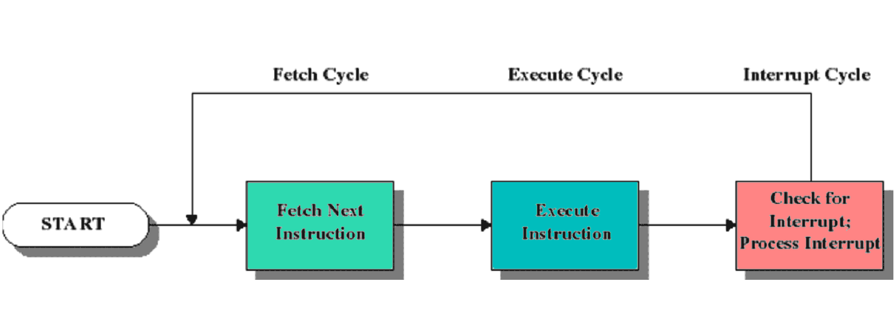
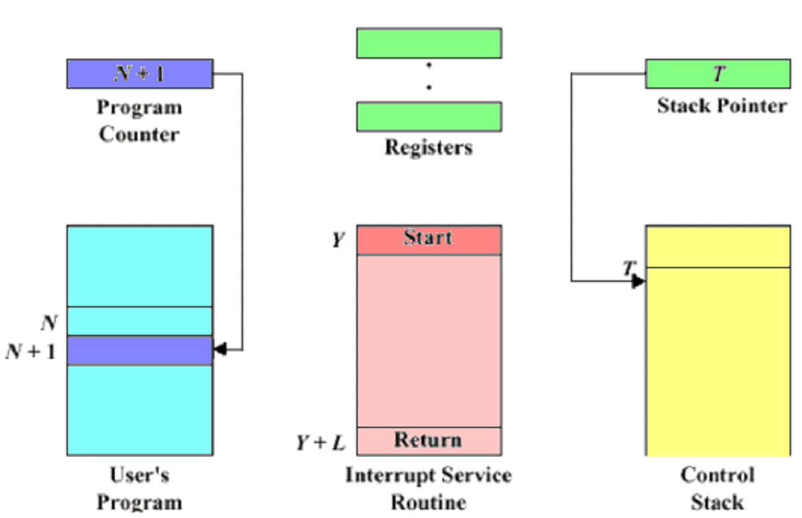
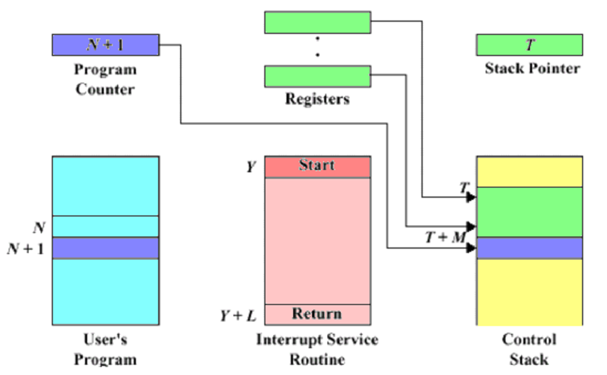
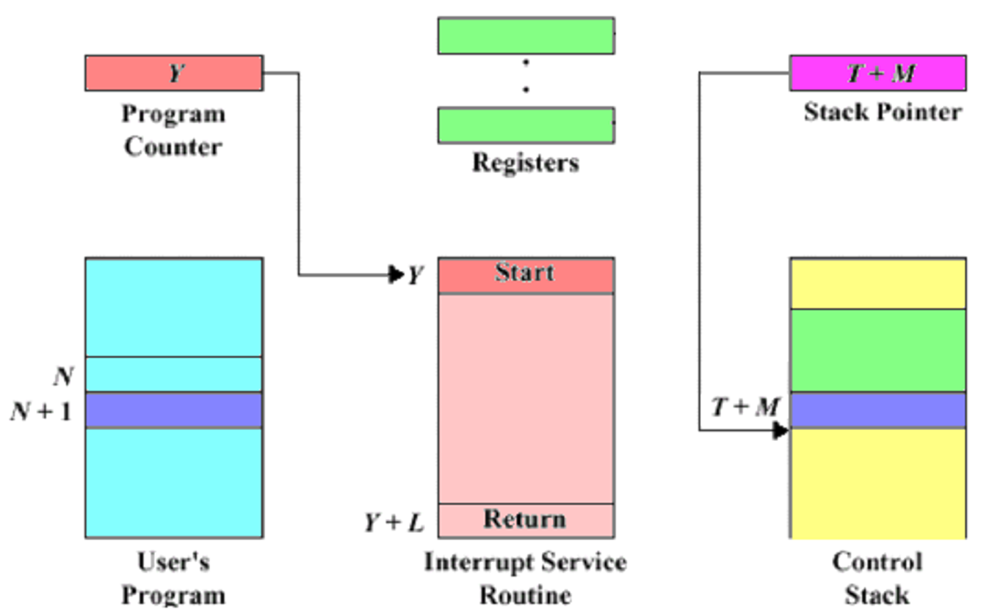
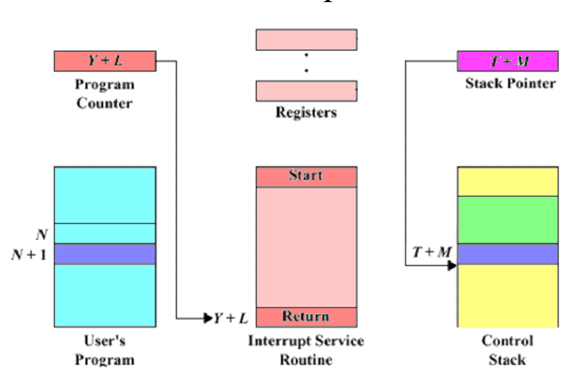
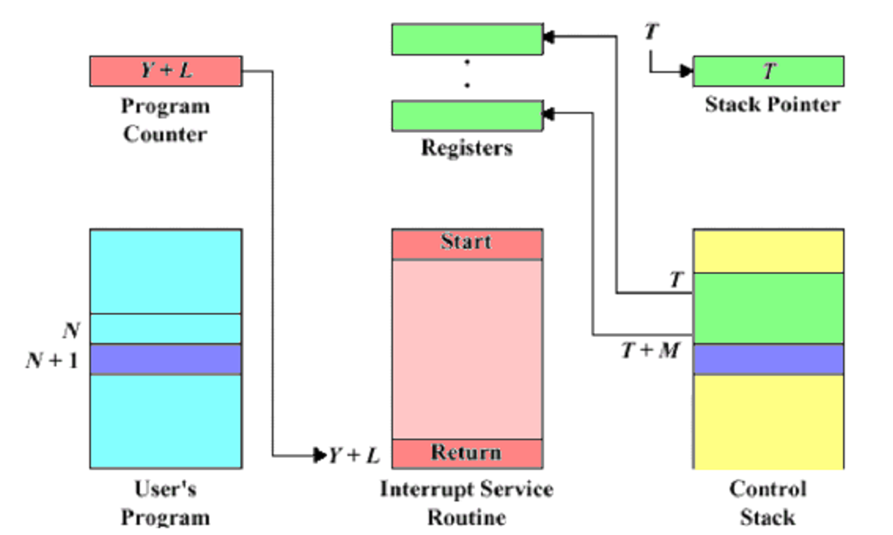
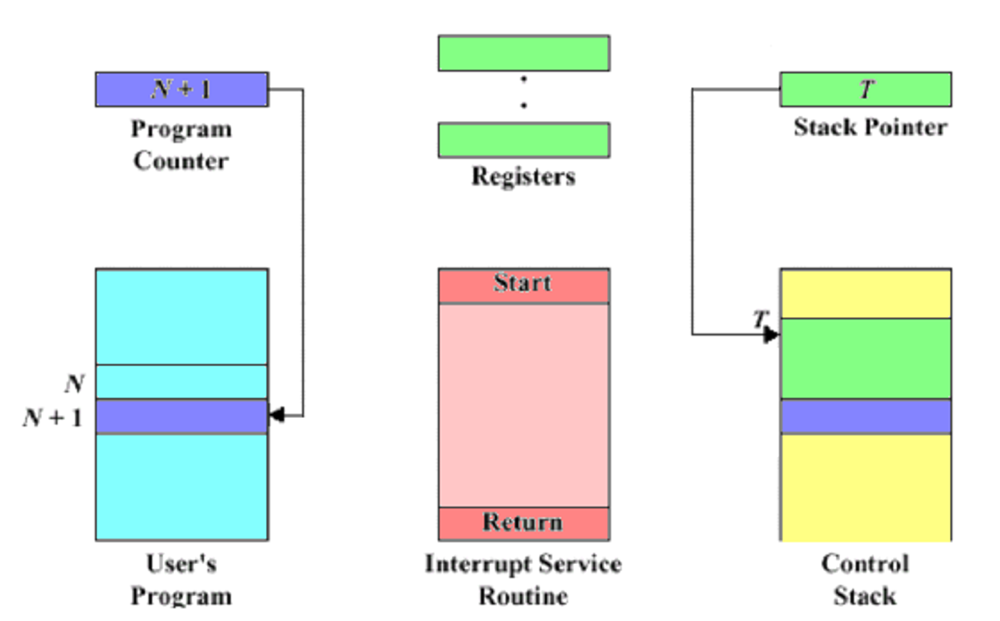
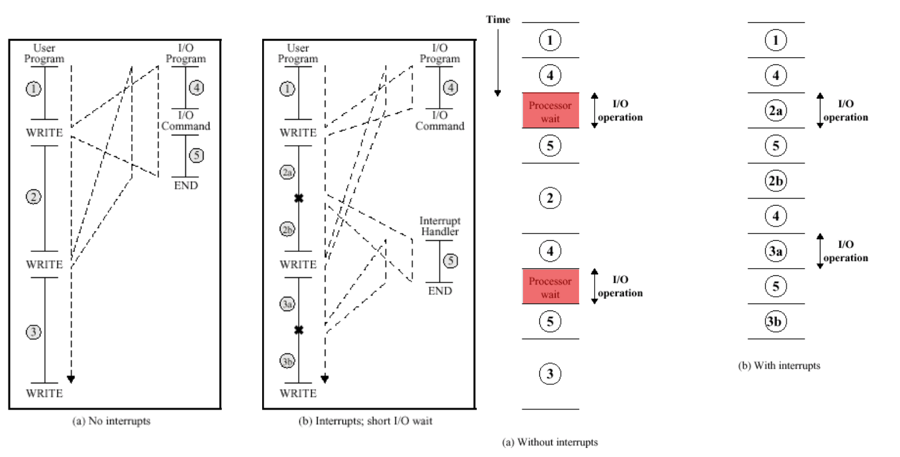

# interrupts

> an `interrupt` is a request for the processor to `interrupt currently executing code` (when permitted), so that the **event** can be **processed** in a **timely manner**

## ISR (intterupt service routine)

SAVE => EXECUTE => RESTORE

<!-- tabs:start -->

### **step 1**

- store PCR register (Program Counter) in PCB (Process Control Block)
- store STACK POINTER in Control Stack

### **step 2**

- store PCR on control stack (kernel)
- store registers on control stack (kernel)

### **step 3**

- set PCR to start of ISR
- update stack pointer

### **step 4**

- execute the ISR

### **step 5**

- restore Registers from Control Stack
- restore Stack Pointer

### **step 6**

- restore program counter
- resume previous execution

<!-- tabs:end -->

## Comparison

> [!NOTE] the CPU is not sitting IDLE

