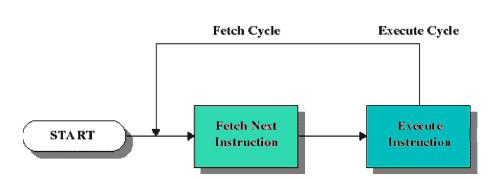
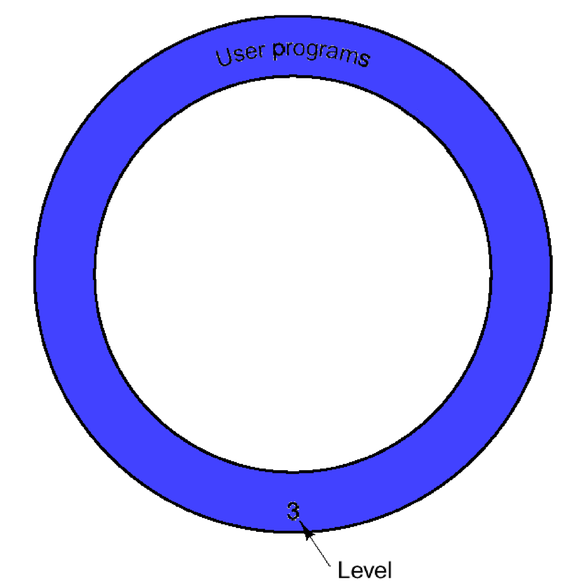
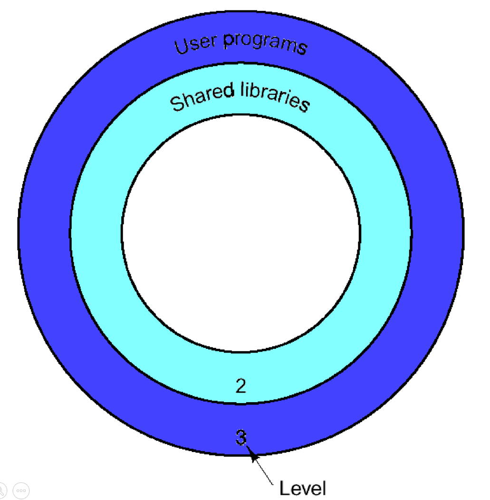
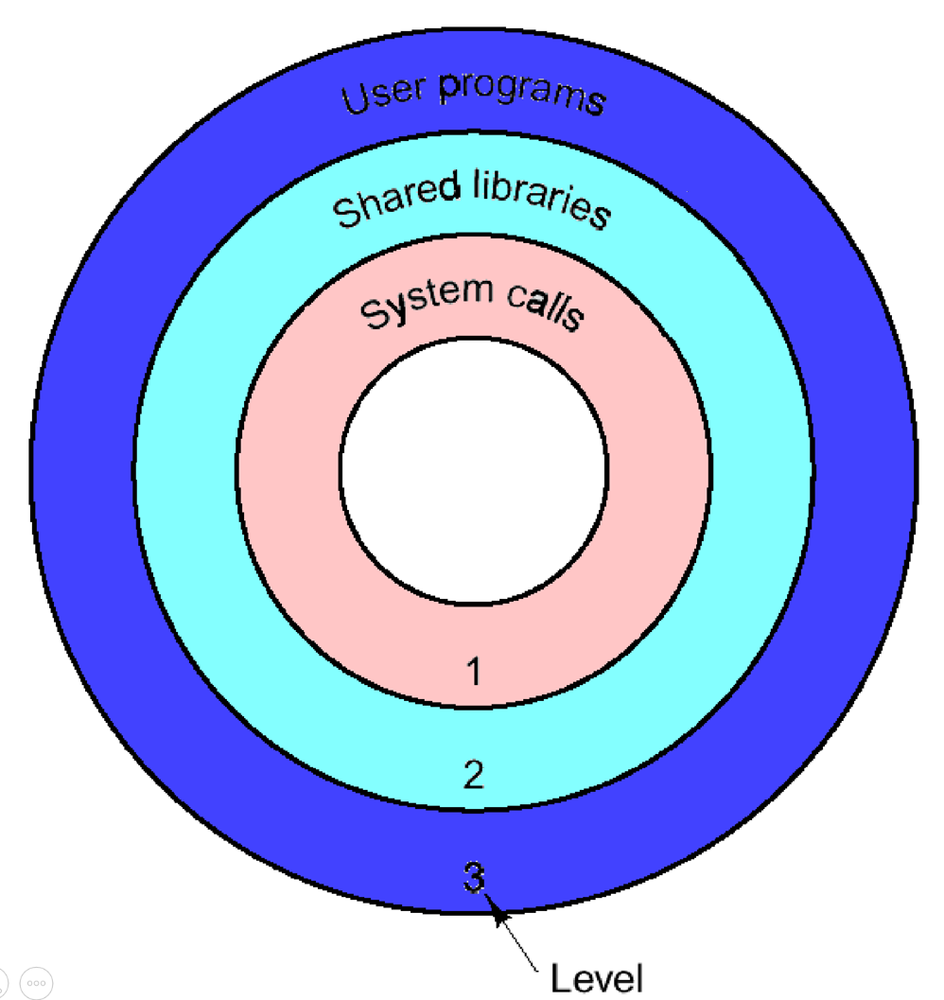
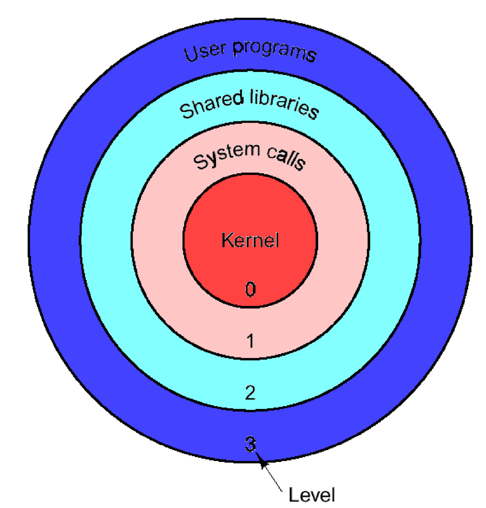

# introduction

Operating Systems are resource managers!

## instruction cycle

The `instruction cycle` (also known as the **fetch**–**decode**–**execute** cycle, or simply the fetch–execute cycle) is the `cycle` that the central processing unit (**CPU**) follows from boot-up until the computer has shut down in order to process instructions.

> [!NOTE] in reality is much more complex
> this is a highlevel overview

## SOFTWARE Hiëarchie

the software hiërarchie can be split in to 4 different levels:

> 0) [kernel](#level-0-kernel) (LOWEST)
> 1) [system calls](#level-1-system-calls)
> 2) [shared libraries](#level-2-shared-libraries-dllso)
> 3) [user programs](#level-3-user-programs) (HIGHEST)

each layer of the software stack interacts with the next and so on. (`interdependency`)

<!-- tabs:start -->

### **level 3 (user programs)**

the first level are user programs.
these are pieces of `software` `executed`, and **managed** by the **Operating System**

### **level 2 (Shared Libraries DLL,SO)**

shared libraries are commonly used pieces of code. these can be recognised by the following extension: **.DLL** **.SO**

#### examples

- libc.so
- win32.dll

### **level 1 (system calls)**

A `system call` is a `controlled entry` point into the `kernel`, allowing a `process` to **request** the **kernel** to perform some `action` on the process's behalf

#### examples

- mmap
- write

> [!NOTE] no SYSCALL access
> **windows** does **not** provide direct access to system calls
> for that the win32api.dll is needed

### **level 0 (kernel)**

the **kernel** is one of the **first programs** loaded on startup (after the bootloader). It `handles` the rest of startup as well as `memory`, `peripherals`, and `input/output (I/O)` requests from software, translating them into data-processing instructions for the central processing unit.

<!-- tabs:end -->