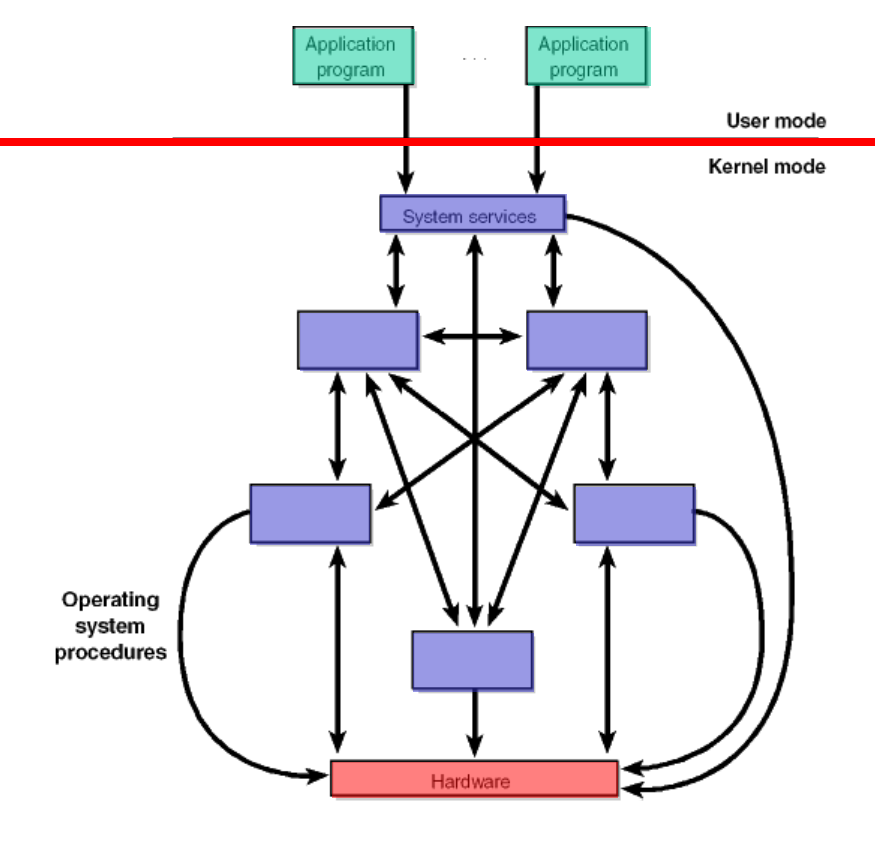
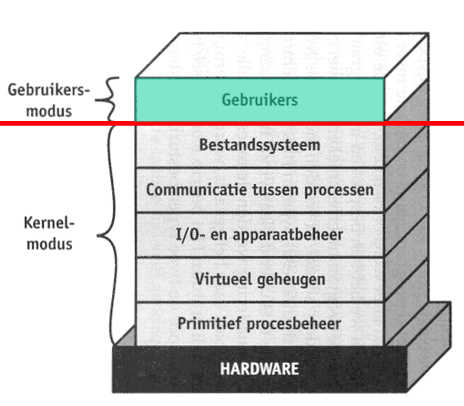
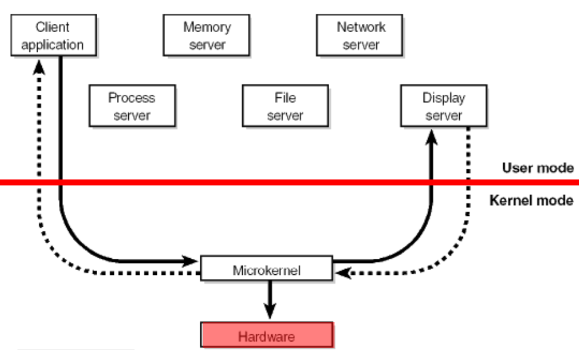
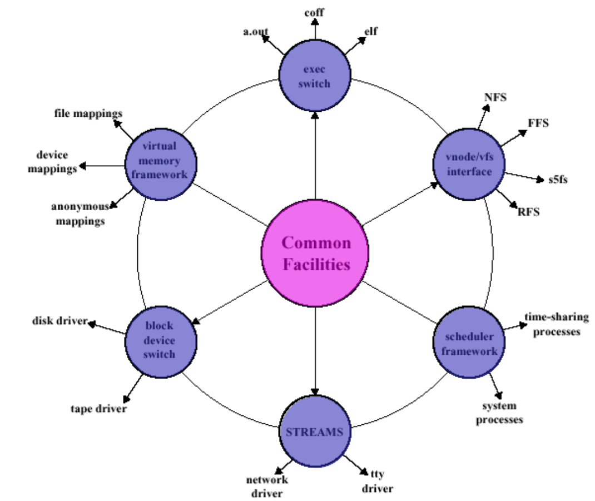

# introduction:

A kernel is a critical component of an operating system that acts as a `bridge` between the `software and the hardware` of a computer.

## types (4)

1) Monolithic
2) Layered
3) Micro
4) Modular

<!-- tabs:start -->

### **Monolithic Kernel**

A kernel type where all modules are interdependent or connected

> [!NOTE] VERY COMPLEX TO MAINTAIN

### **Layered Kernel**

A kernel type where each subsystem is build on top of the layer beneath it!

> [!NOTE]
> You don't always need a certain layer of the system which makes it so you need to build `"highways"` for `frequently used code paths` defeating the layered infrastructure.

### **Micro Kernel**

A microkernel is the `near-minimum` amount of `software` that can provide the mechanisms `needed to implement an operating system` (OS). These mechanisms include:
1)  low-level address space management
2)  thread management
3)  inter-process communication

### **Modular Kernel**

A modular kernel is an attempt to merge the good points of kernel-level drivers and third-party drivers. In a modular kernel, some parts of the system core will be located in independent files called modules that can be added to the system at run time.

<!-- tabs:end -->