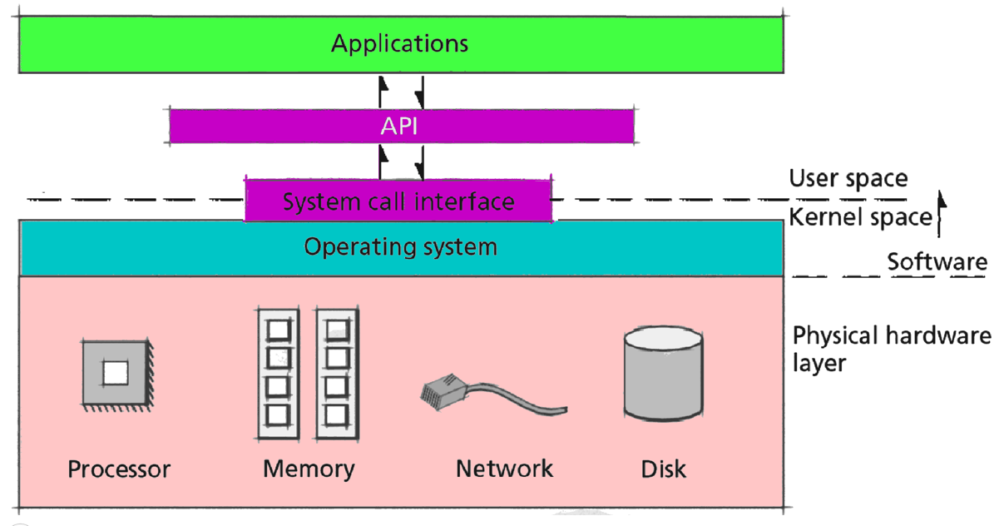
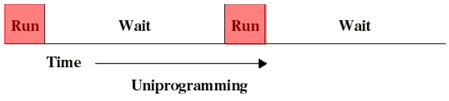
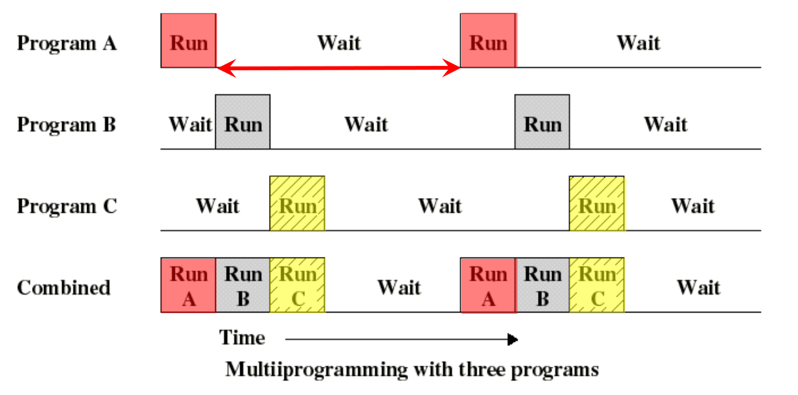
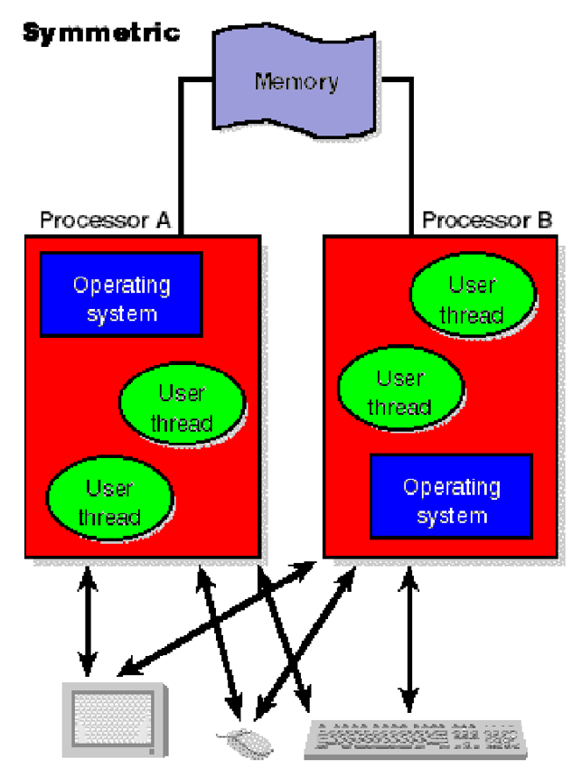

# The Operating System

<!-- tabs:start -->

## **system call interface**

A `syscall interface` is a `contract` between the `kernel` and any number of `userspace processes`, and processes should be able to be developed independently of the kernel

## **api**

The api is the `standardised` library/ api that `sits between` normal `programs` and the operating system.
On Unix-like systems, that API is `usually part` of an `implementation` of the `C library (libc)`, such as glibc, that provides `wrapper functions` for the system calls, often named the same as the system calls they invoke.

## **applications**

The end user application interfaces via this standardised API this allows portability even with a different SYS CALL INTERFACE.

<!-- tabs:end -->

## functions of the OS

<!-- tabs:start -->

### **Virtualisation**

`simpler`, `layered interface` to users and programmers.

### **Simple Interface**

- `Loading` and `executing` of programs
- access to `utility programs`
- `handeling` soft/hardware `faults`
- uniform `IO` interface
- uniform `file access`
- process sync
- security
- usage and performance `statistics`

### **Resource Manager**

assinging system resources:

- processors
- memory
- IO and files

<!-- tabs:end -->

## processing types (3)

<!-- tabs:start -->

### **Uni Programing**

### **multi tasking**

### **multi processing**

> [!NOTE]
> in this context `processor` can also mean `core`

<!-- tabs:start -->

#### **Assymetric**

`1` Operating System instance (entire system)

#### **Symetric**

each processor/core has an Operating System instance

<!-- tabs:end -->

<!-- tabs:end -->
