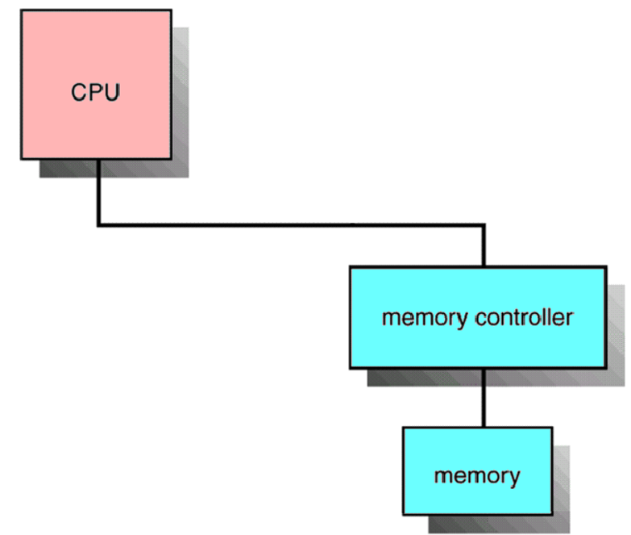
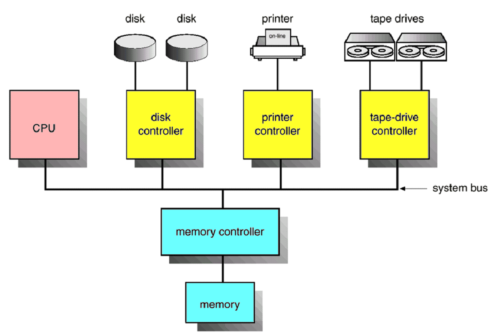
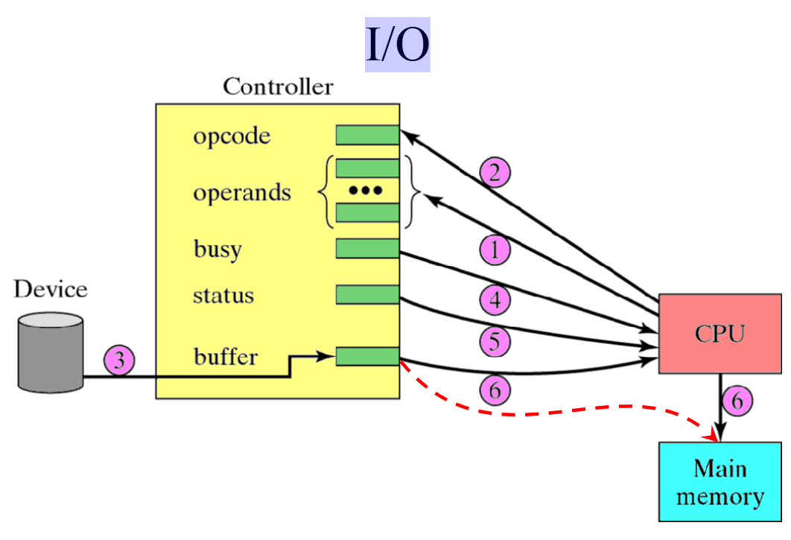
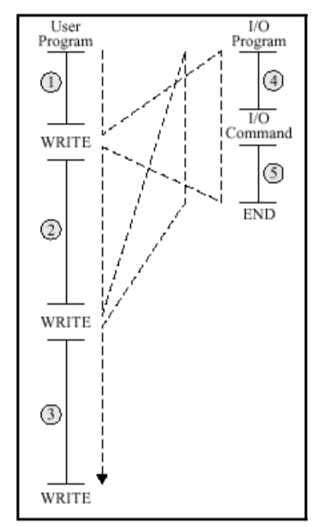
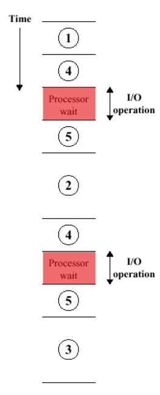

# peripherals/edge devices

A computer `peripheral`, also known as a peripheral device, is an `external device` that connects to a computer to **expand** its **capabilities**.
<!-- tabs:start -->

## **basic computer overview**

A computer needs at most `3` things to operate:

1) CPU
2) Memory Controller
3) Memory

but this not leave us any way to see what the computer does so => peripheral devices.

## **peripherals overview**

All peripherals are connected to the system bus togheter with the memory controller. thus allowing direct access by the CPU

<!-- tabs:end -->

## peripheral controller example

**All devices have a controller**, wich allow the CPU to control the peripheral device.

### controlling the controller (6 steps)

1) set the operands (what do we want?)
2) set the opcode (tell the controller what to do)
3) controllers executes instructions
4) CPU receives busy flag and waits
5) controller sets the Status flag to ready.
6) CPU acknowledges status and copies data to ram

## visualised
<!-- tabs:start -->

### **control flow**

### **time table**

<!-- tabs:end -->

> [!NOTE] obvious problem
> there is an `obvious problem` here:
> the CPU is siting IDLE
>
> SOLUTION: **interupts**

