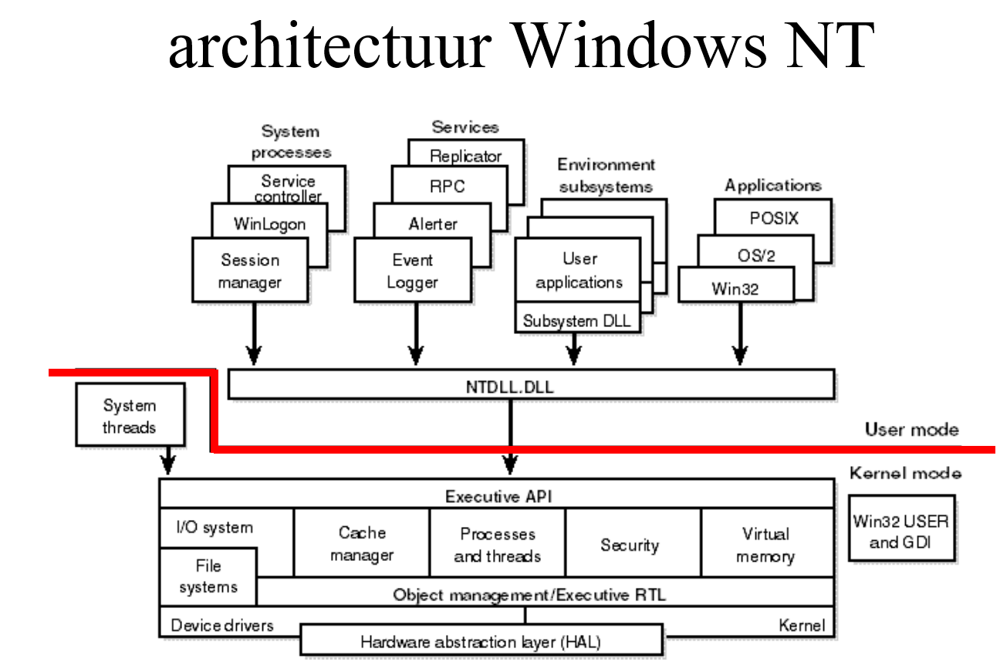
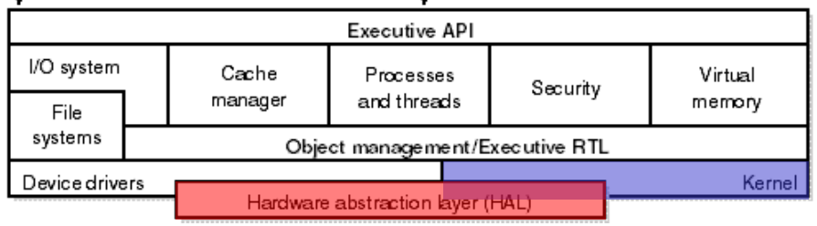
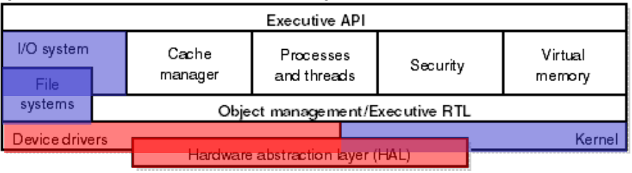
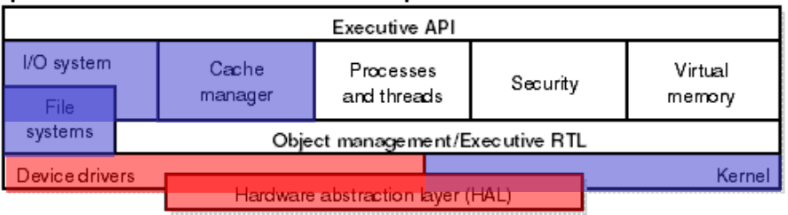
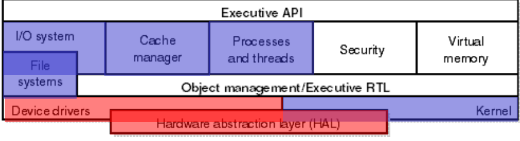
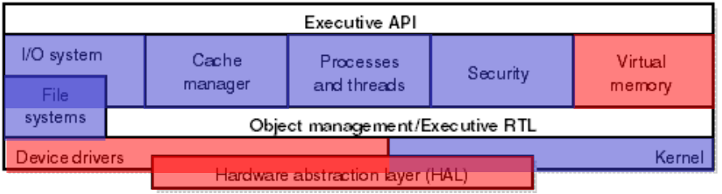

# windows NT

## KERNEL COMPONENTS

### KERNEL MODE

> [!IMPORTANT]
> RED => hardware specific
> BLUE => KERNEL specific
<!-- tabs:start -->

#### **`HAL` (Hardware Abstraction Layer)**

> [!NOTE]
> the **HAL** abstracts hardware specific components like:
> 1) timers
> 2) chipset

#### **`Kernel` (Micro Kernel)**

> [!NOTE]
> the `kernel` runs `on top` of the `HAL`.

> [!IMPORTANT]
> the micro kernel is responsible for:
> - memory management
> - IPC (Inter Process Communication)
> - Task Scheduling
> - Context Switching
> - interrupt handling

#### **IO Manager**

> [!NOTE]
> the `IO Manager` is `layered`

<!-- tabs:start -->

##### **`IO System`**

> [!NOTE]
> the IO System is the common interface for all IO-operations.

##### **`File System`**

> [!NOTE]
> Different drives have different file systems => filesystem implementation per supported type

##### **`Device Drivers`**

> [!IMPORTANT]
> Device Drivers are the specific implementation for certain hardware type:
> - HDD,SSD.
> - Network Card.
<!-- tabs:end -->

#### **`Cache Manager`**

> [!NOTE]
> the `cache manager` manages the `DISK cache`

#### **`Processes and Threads`**

> [!IMPORTANT]
> this component `manages` process/thread `Objects`

> [!WARNING]
> Context switching is done by the micro kernel.

#### **`Security Manager`**

> [!IMPORTANT]
> This module checks if you are allowed to do certain changes, like file edits, change processes.

#### **`Virtual Memory`**

this module mostly handles paging related tasks, paging on demand(only get what is neccesary not everything). 

> [!NOTE]
> Virtual memory is managed by the micro kernel

##### Page Faults

> [!NOTE] Minor:
> needs to map to an already loaded page in to the process virtual memory table. (glibc, Shared Libraries)

> [!NOTE] Major:
> needs to load a page from the page file on disk in the process virtual memory
<!-- tabs:end -->
