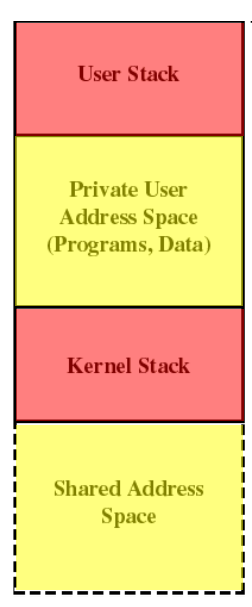

# process information

kernels store information in tables.

## process memory

Yellow= private, **Code**, **data** segments.
Red= private **Stack** segments.

### **User Stack**

`dynamic memory region` used while the program is running in `User Mode`.

### **Private User Address Space**

`dynamic memory region` containing the the porgram source code and `allocated memory regions`

 