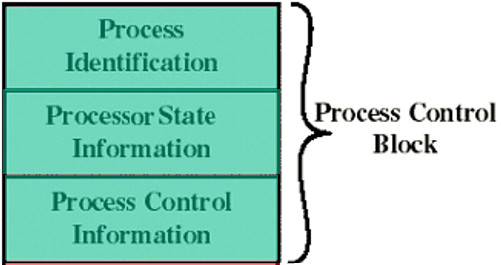
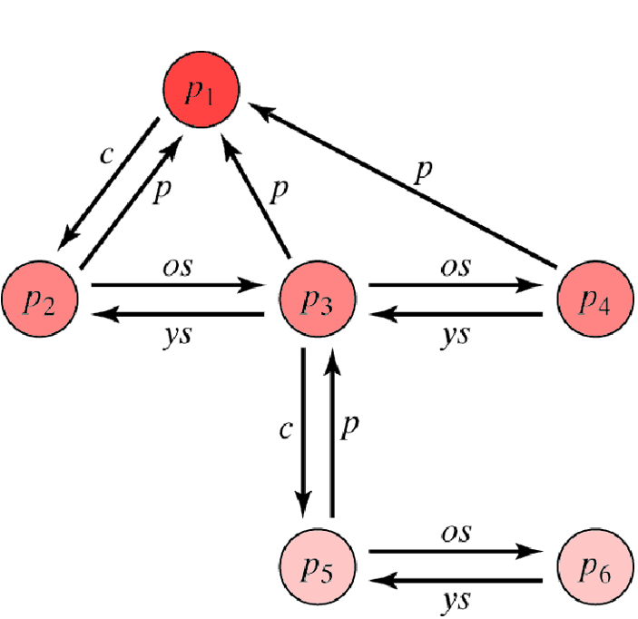
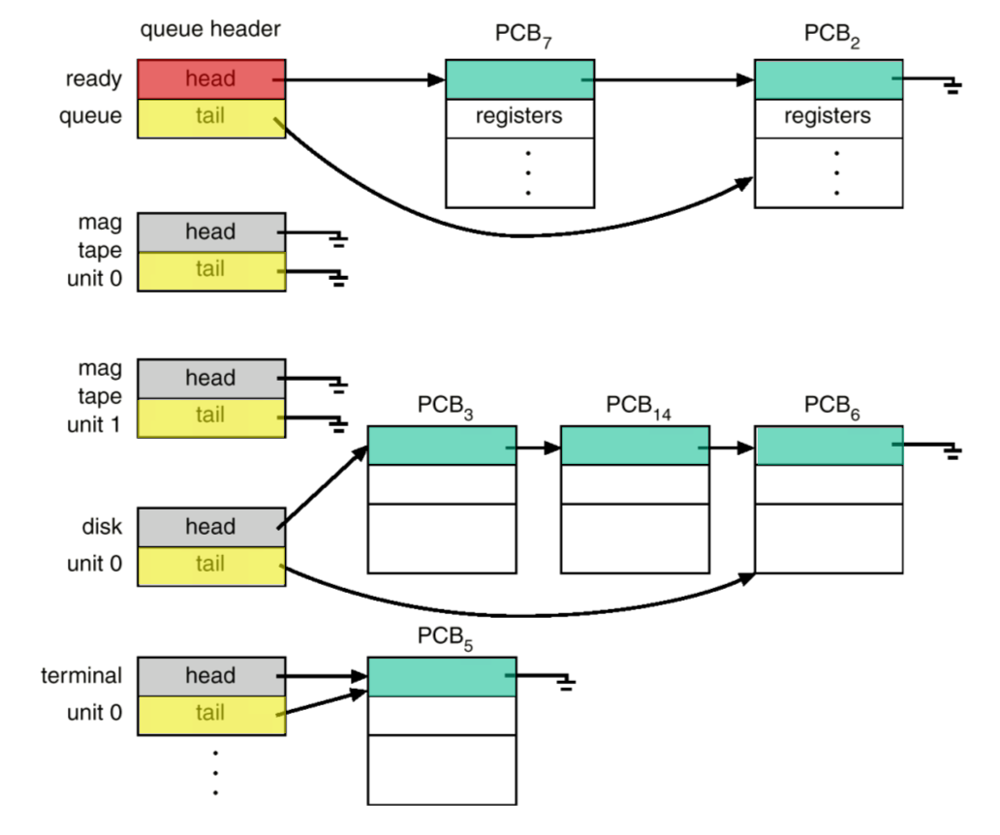

# process information

kernels store information in tables.

## process memory

Yellow= private, **Code**, **data** segments.
Red= private **Stack** segments.

### **User Stack**

`dynamic memory region` used while the program is running in `User Mode`.

### **Private User Address Space**

`dynamic memory region` containing the the porgram source code and `allocated memory regions`

### **Process Control Block (PCB)**

1) Identification
2) State
3) Control

<!-- tabs:start -->

#### **`Process Identification`**

#### **`Processor State`**

##### 1 scheduling state info

- state
- priority
- event that blocked
- delay time, cpu-time

##### 2  Structural Information

#### **`Processor Control`**

1) Location process View
2) source refs
    - assigned
    - requested
3) IPC info (Inter process Communication)
4) MEM table references (MMAP, heaps)
5) Privileges, limits, quota

<!-- tabs:end -->

### **Sheduler view**

