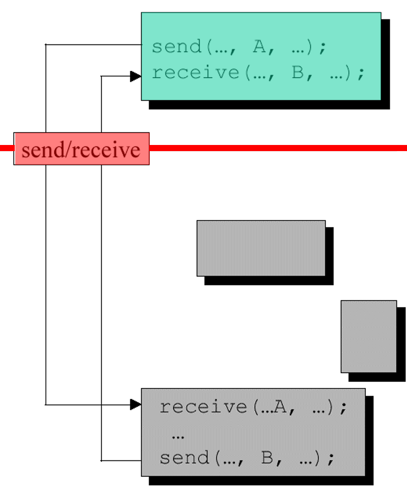
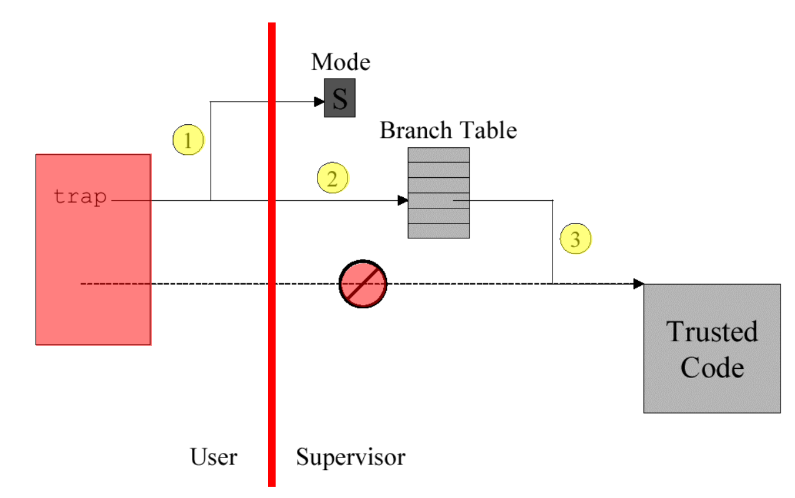
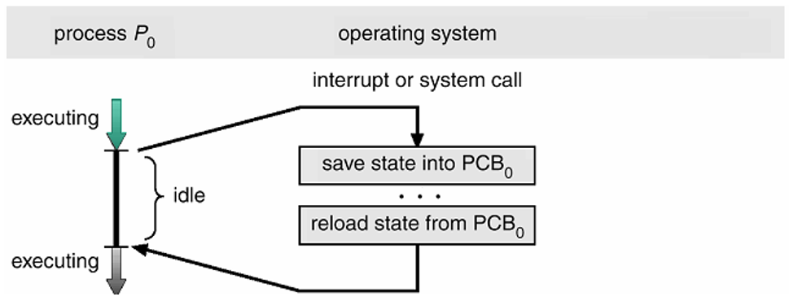
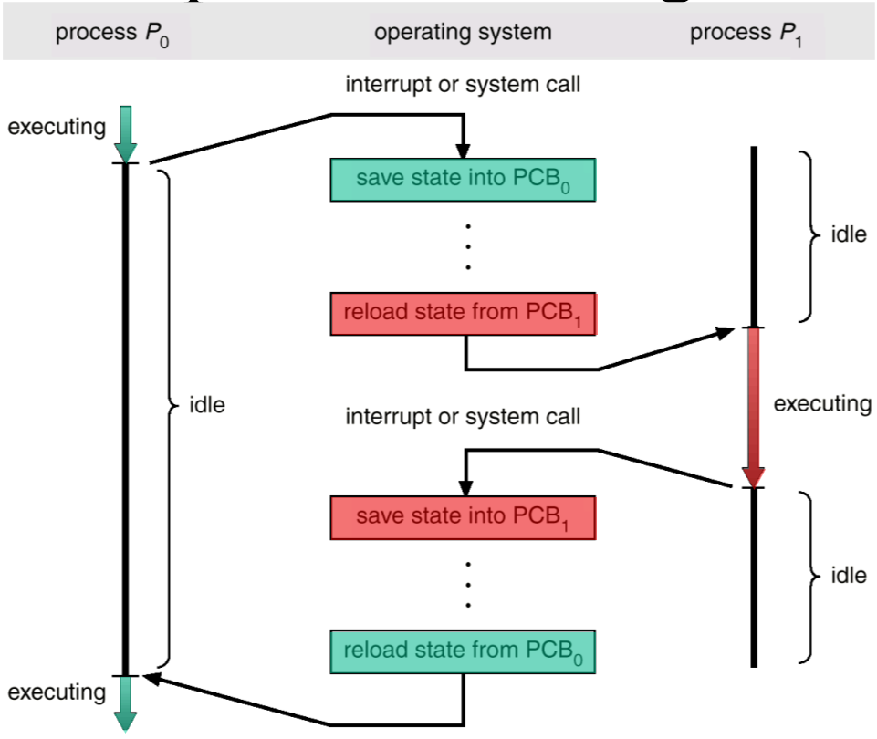
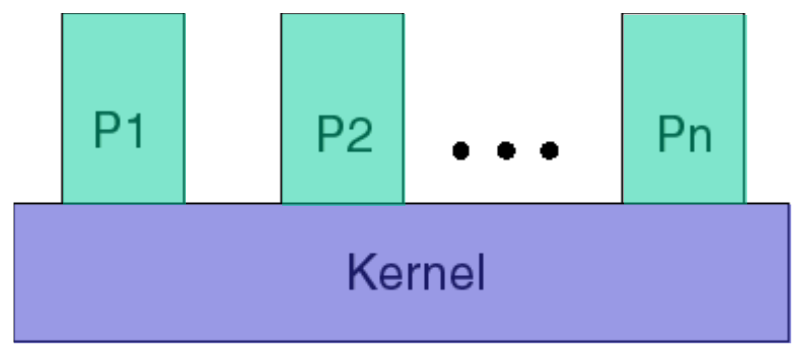

# Process Switching 

> [!NOTE]
> When does the Operating System Gain Control?
>
> On INTERRUPT

## Interrupt types

1) timer interrupts
2) IO
3) traps
4) syscalls
5) Page Faults (page is not in process memory)

## SYS-CALL

## SWITCHING (3)

- CONTEXT
- PROCESS

#### **`Context` Switch**

- happens after QUANTUM passed.

#### **`Process` Switch**

## OS-functions

Does the operating system exist out of processes

### **Monolith Kernel**

