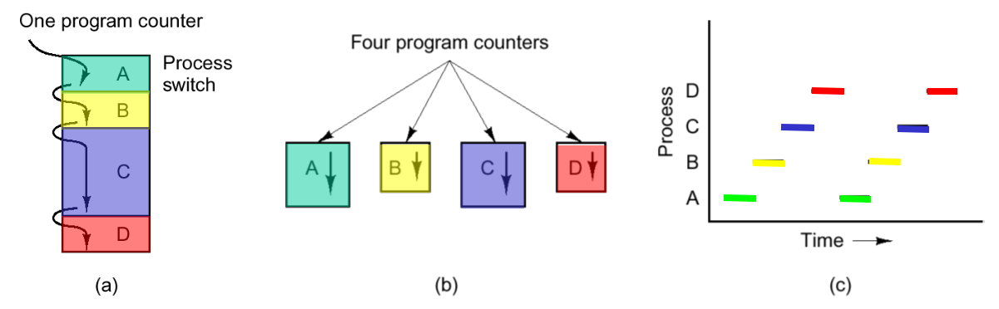

# processes

## defenitions (2)
<!-- tabs:start -->

### **1**

> [!NOTE] PROCESS
> eenheid van verdeling van processorinstructies

### **2**

> [!NOTE] PROCESS
> eenheid voor de eigendom van bronnen
>
> - RAM usage
> - secondary adress space

<!-- tabs:end -->
