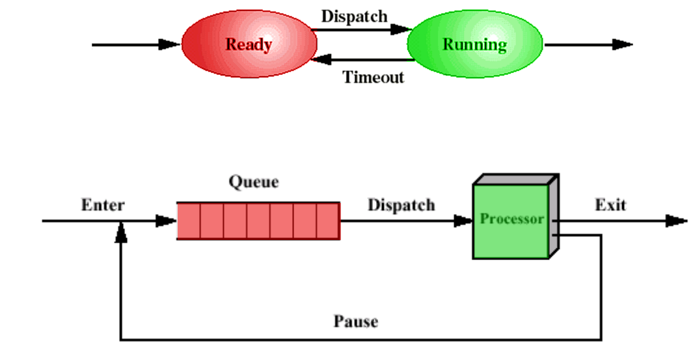
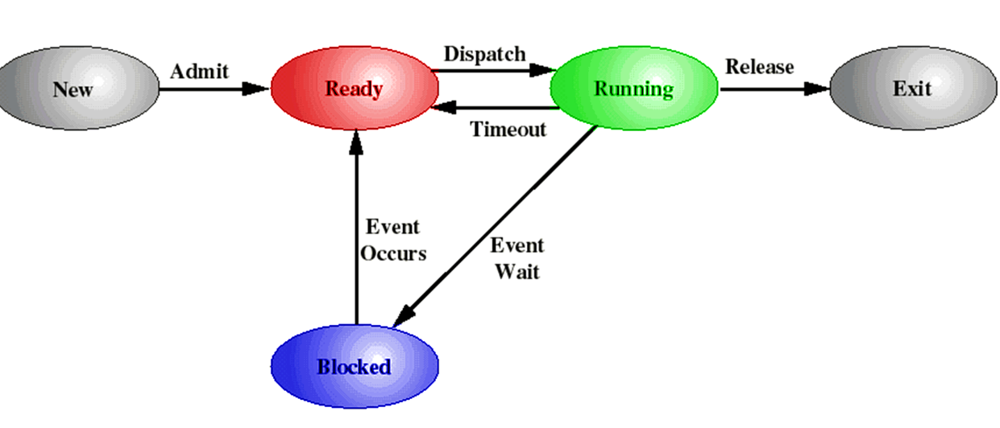
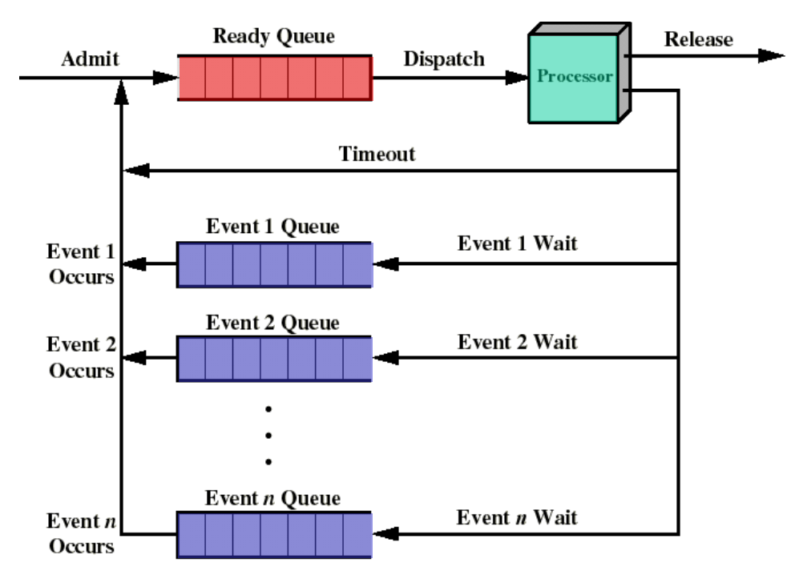
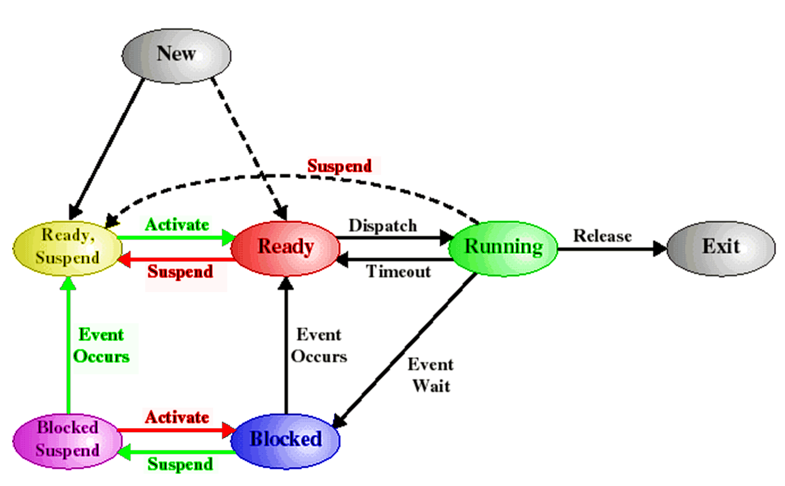

# processes

## defenitions (2)
<!-- tabs:start -->

### **1**

> [!NOTE] PROCESS
> eenheid van verdeling van processorinstructies

### **2**

> [!NOTE] PROCESS
> eenheid voor de eigendom van bronnen
>
> - RAM usage
> - secondary adress space

<!-- tabs:end -->

## sheduling

### **timeout/ round robin based sheduling**

> [!IMPORTANT] What if a `process needs to wait` for a `syscall` to complete? do we waste CPU cycles?

### **5 state Model**

in this model a process can have 5 sheduling states:

> 1) new
> 2) ready
> 3) running
> 4) blocked
> 5) exit

### **7 state model**

> The 7 state model is 2 states:
>
> 1) Blocked, Suspend
> 2) Ready, Suspend
> 

