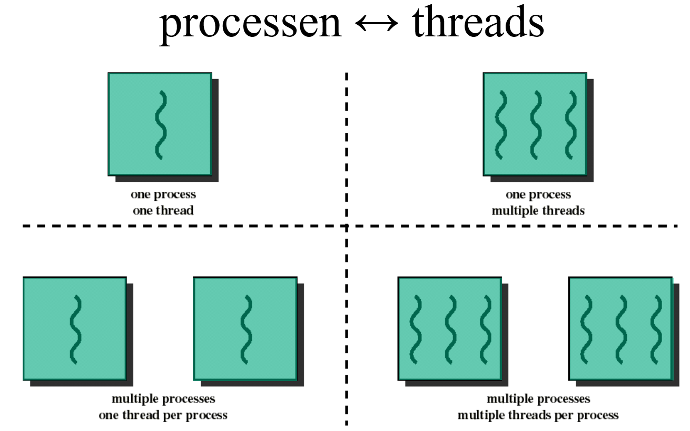
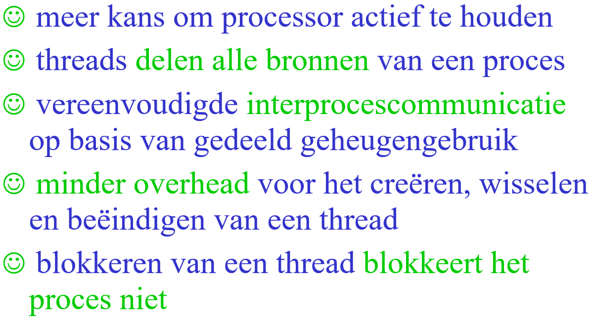
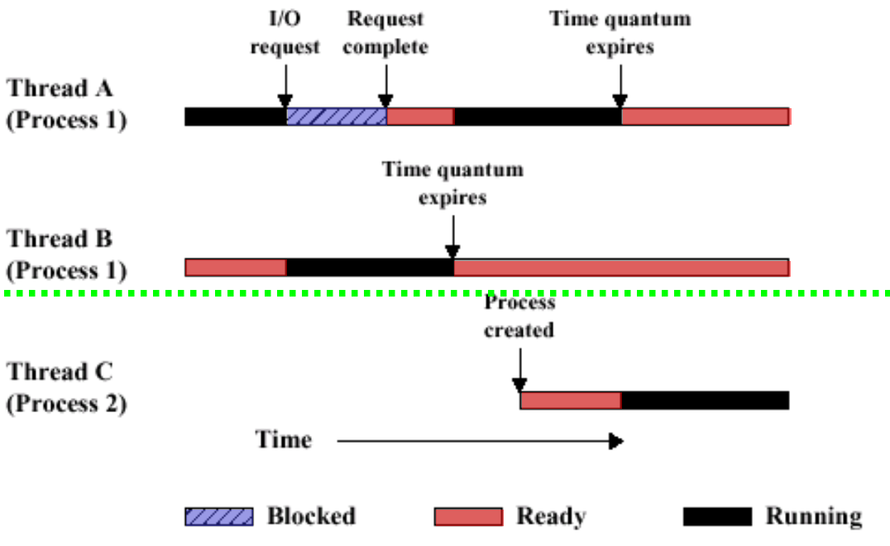
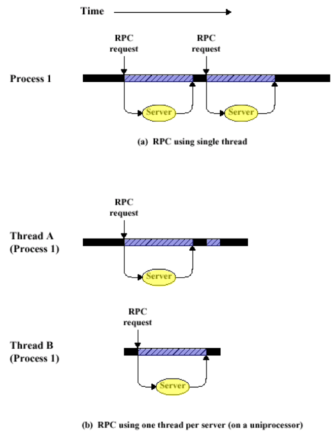
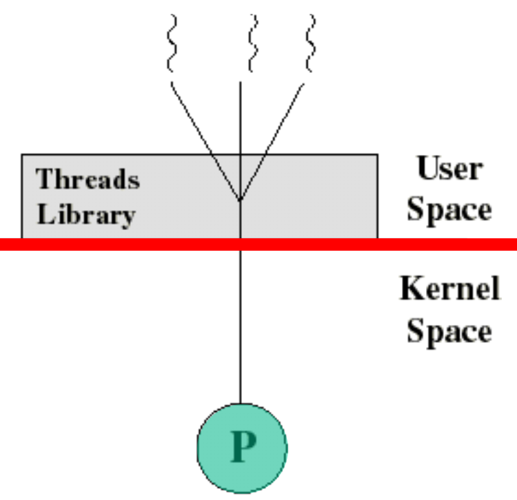

# threads

> [!NOTE] THREAD
> eenheid van verdeling van processorinstructies

## Example

### Timeline

### RPC

## Thread Types

### **User level Threads**

> [!NOTE]
> # PROS
> 1) Platform independent
> 2) Thread switching has no overhead
> 3) Purpose build scheduling
> 
> # CONS
> 1) Blocking A thread blocks the process
> 2) At most one active thread

### **kernel level Threads**

> [!NOTE]
