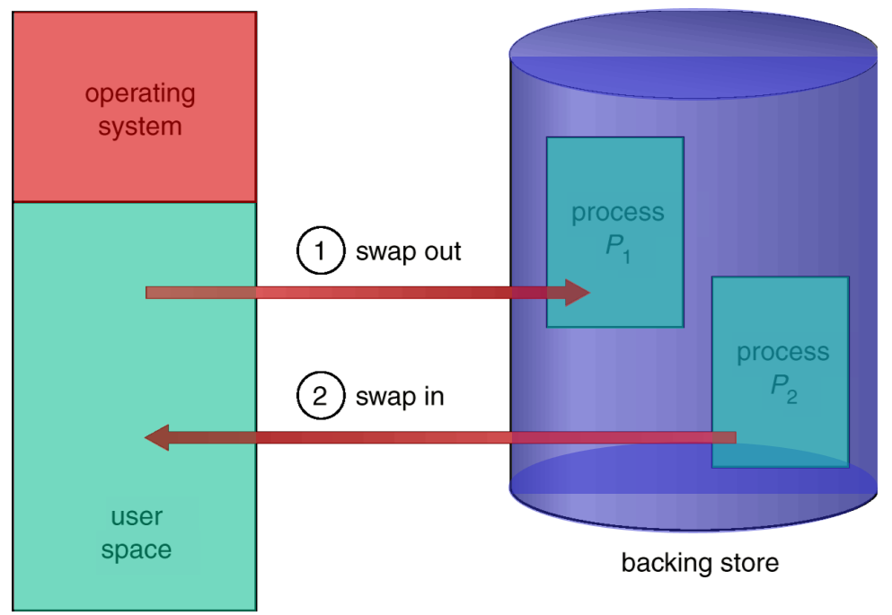

# chapter 4 (memory management)

> [!NOTE]
> memory is `finite/limited` => hence we `move/swap` unused `memory to disk` (swap space/file)

> [!NOTE]
> the process user space is `virtualized` IE `Process Addr` != `Physical Addr`.

> [!NOTE]
> this virtualization allows us to also add memory protections, thus making it so that process A cannot access process B

## Table of Contents 

<!-- tabs:start -->
### **partitioning**
- [fixed](/chapter4/parititioning/paritioning.md#_1-fixed-partitioning)
- [dynamic](/chapter4/parititioning/paritioning.md#_2-dynamic-partitioning)
<!-- tabs:end -->
