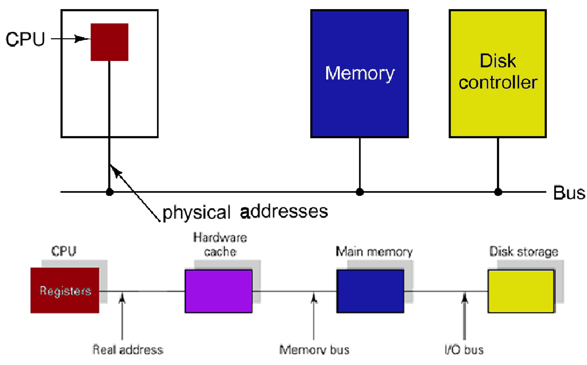
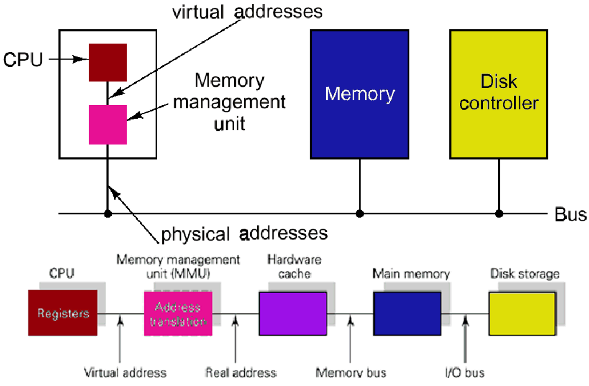

# pagination

with `pagination` we will `introduce` some `specialized hardware` to help us manage memory.

## 1 virtualization

> [!NOTE]
> Address Virtualization would solve allot of our problems, but the hardware does not like virtual addresses.

> [!WARNING]
> letting the `process/code handle` the address `translation` is slow => new cpu subsystem: `Memory Management Unit (MMU)`.

### translation

> [!NOTE]
> when the `comparator` is `tripped` an `interrupt` is raised to the OS and the process is terminated