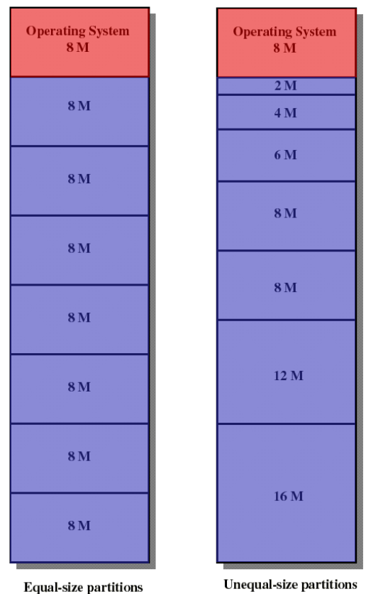
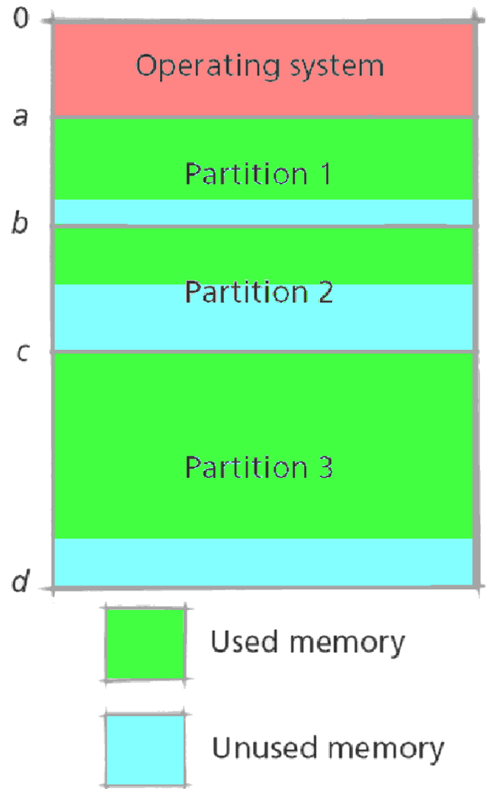
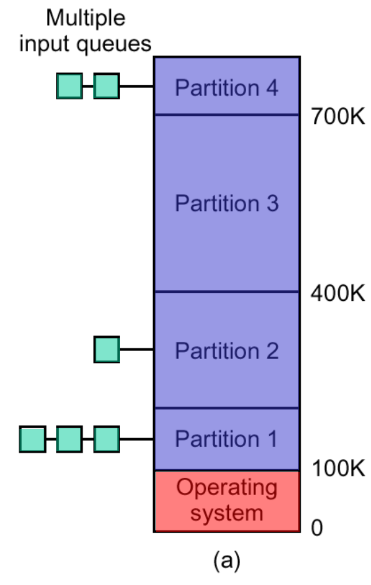
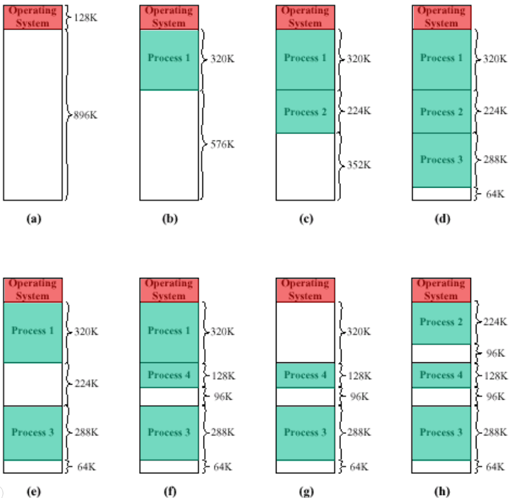
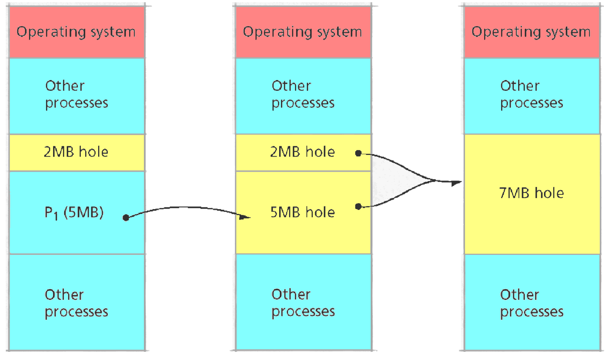
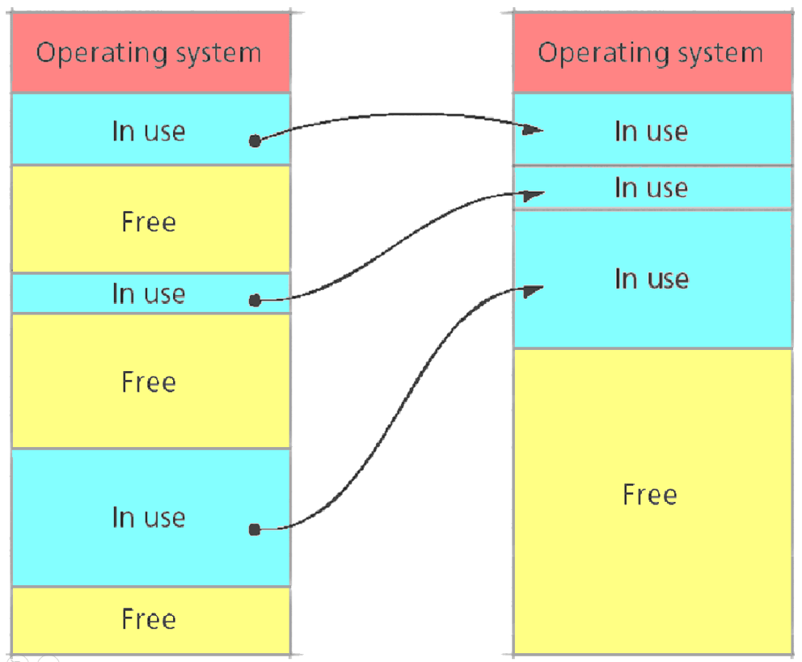

# Partitioning (2)

Partitioning is a `technique` where we `split` the `memory map` in equal/ not equal parts!

1) Fixed Partitioning
2) Dynamic Partitioning

## 1 Fixed Partitioning

### Issues

> [!NOTE]
> **outdated**
>
> issues:
> 1) Fragmentation
> 2) Overlay
> 3) Input queue => prevent overlay

<!-- tabs:start -->
#### **Fragmentation**

> [!NOTE]
> cause fragmentation because process data needs to be split to fit the partitions

#### **Overlay**

code does not fit in a single partition => we use and overlay driver.

> [!WARNING] 
> allot of extra code is needed to solve this issue => not efficient

#### **Input Queue**

we use an input queue to solve the overlay issue. this way we don't have the overhead of the overlay driver.
<!-- tabs:start -->

##### **Multiple Queues**

##### **Single Queue**

<!-- tabs:end -->

<!-- tabs:end -->

## 2 Dynamic Partitioning

Make the `partition` fit the `required size`

### All is well (initially)

### Merging sequential partitions

### Housekeeping

> [!WARNING]
> Very expensive resource wise!

## 3 Allocation Strategies (3)

> [!NOTE]
> `First fit` is the most `performant`, and the `easiest` to implement

1) First fit
2) Best Fit 
3) Next Fit

